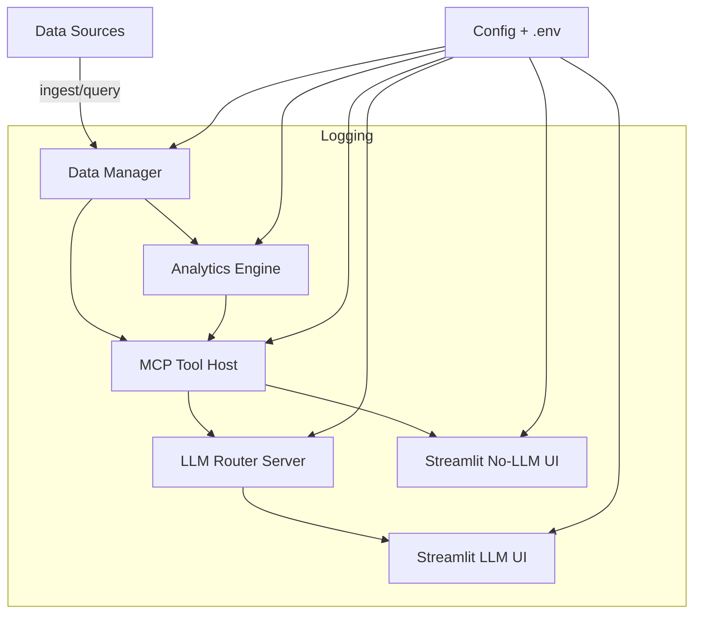
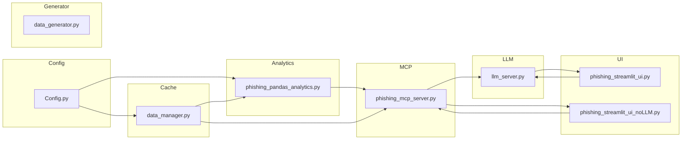

# PHISHING

## Overview

This project is a phishing simulation analytics platform that combines data engineering, model routing, and Streamlit visualization. It supports a local FastAPI/LMM server, an MCP tool host, and two UIs: one with LLM-assisted summaries and one deterministic no-LLM interface.

## Project Structure

- `Config.py` - central feature engineering, semantic model loading, and pipeline configuration
- `data_generator.py` - synthetic phishing dataset generator and optional database loader
- `data_manager.py` - primary cache manager with MSSQL fallback and metadata tracking
- `llm_server.py` - LLM routing server for tool selection and summarization
- `phishing_mcp_server.py` - MCP tool host with analytics, prediction, and cache management
- `phishing_pandas_analytics.py` - analytics engine and business guidance toolbox
- `phishing_streamlit_ui.py` - Streamlit UI with LLM-assisted narrative and trace logging
- `phishing_streamlit_ui_noLLM.py` - deterministic Streamlit UI without LLM inference
- `tests/` - unit tests

## System Architecture

> Note: Mermaid diagrams require a Mermaid-compatible Markdown preview tool or GitHub rendering to display correctly.

### High-level architecture



### Module-level architecture



### Module build-up

- `Config.py`
  - Loads environment variables and `.env`
  - Defines dataset feature rules, target mapping, drop columns, PII columns
  - Loads semantic model/tokenizer and exposes feature engineering utilities

- `data_generator.py`
  - Builds synthetic phishing simulation data
  - Inserts nulls and generates user/event metadata
  - Can save generated data into MSSQL via ODBC

- `data_manager.py`
  - Maintains the primary in-memory data cache
  - Connects to MSSQL or falls back to a local mock dataset
  - Tracks refresh status, row counts, and cache metadata

- `llm_server.py`
  - Hosts FastAPI endpoints for tool selection and summarization
  - Loads local or remote LLM and semantic models when enabled
  - Produces JSON arguments for downstream tool execution

- `phishing_mcp_server.py`
  - Acts as the FastMCP tool host
  - Executes analytics, prediction, cache control, and system diagnostics
  - Applies RBAC, sanitization, and structured tool contracts

- `phishing_pandas_analytics.py`
  - Contains the core analytics and recommendation engine
  - Computes risk scores, group summaries, employee profiles, and guidance
  - Sanitizes outputs for user/admin roles and formats results

- `phishing_streamlit_ui.py`
  - Provides an LLM-assisted interface with narrative summaries
  - Sends questions to the LLM router and renders tool outputs with trace logs
  - Maintains session state, chat history, and debug trace visibility

- `phishing_streamlit_ui_noLLM.py`
  - Implements deterministic tool routing without LLM generation
  - Uses local cosine scoring and direct MCP execution
  - Displays raw outputs, step traces, and tool selection reasoning

## Environment

The project uses `.env` for configuration. A sample `.env` has been created in the repository root and includes the core variables needed for database connections, model paths, server settings, caching, and logging.

### Key `.env` settings

- `DB_SERVER`, `DB_DATABASE`, `DB_TABLE`, `ODBC_DRIVER`
- `MODEL_PATH`, `SEMANTIC_MODEL_PATH`, `FEATURE_COLUMNS_PATH`
- `LLM_SERVER_URL`, `LLM_SERVER_HOST`, `LLM_SERVER_PORT`
- `USE_LLM`, `LOAD_LLM_ON_STARTUP`, `LOCAL_LLM_LOCAL_FILES_ONLY`
- `GLOBAL_ANALYTICS_ROWS`, `CACHE_AUTO_REFRESH_MINUTES`, `HIGH_RISK_THRESHOLD`
- `MCP_EXECUTION_MODE`, `MCP_SERVER_COMMAND`, `MCP_SERVER_SCRIPT`
- `LOG_LEVEL`

## Setup

1. Create and activate a conda environment:

```bash
conda create -n phishing python=3.11 -y
conda activate phishing
```

2. Install dependencies:

```bash
pip install --upgrade pip
pip install -r .requirements.txt
```

3. Configure `.env` with your local settings.

## Running the application

### Start the LLM router server

```bash
uvicorn llm_server:app --host 127.0.0.1 --port 8001
```

or:

```bash
python llm_server.py
```

### Start the main Streamlit UI

```bash
streamlit run phishing_streamlit_ui.py
```

### Start the no-LLM Streamlit UI

```bash
streamlit run phishing_streamlit_ui_noLLM.py
```

## Testing

Run the included unit test:

```bash
python -m unittest tests/test_llm_server_import.py
```

## Logging

Logging is enabled across the project to support diagnostics and traceability. Key modules with logging include:

- `Config.py`
- `data_generator.py`
- `data_manager.py`
- `llm_server.py`
- `phishing_mcp_server.py`
- `phishing_pandas_analytics.py`
- `phishing_streamlit_ui.py`
- `phishing_streamlit_ui_noLLM.py`

Log output is formatted with timestamps, levels, and structured messages for easier debugging.

## Notes

- `pyodbc` is required for MSSQL connectivity.
- `transformers` and `torch` are required for semantic and LLM model loading.
- Edit `.env` before running any server or UI to ensure the correct database and model paths are configured.
